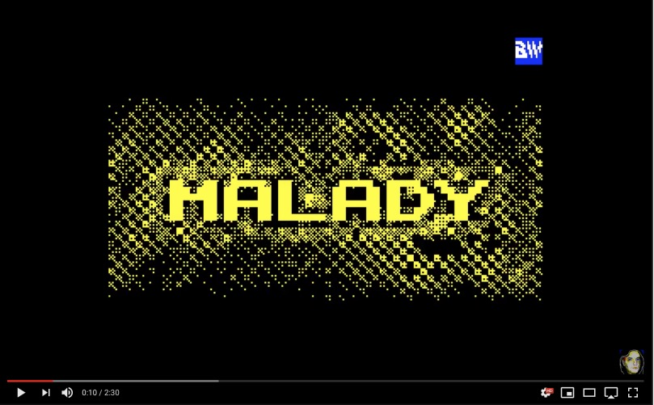

# Malady — a 4K Intro for ZX Spectrum

Written in 1999, took 3rd place at CAFe'99 demoparty in ZX 4K Intro Compo.

[Malady at pouët.net](http://www.pouet.net/prod.php?which=1969)

[Watch Malady on YouTube](https://www.youtube.com/watch?v=CvZNnYb1cZQ)

The list of effects:

- Water effect
- Raycasting
- Motion-blurred roto-zoomer
- 2D Turing machine
- Fire effect

I thought that the source code years ago was lost, but I found it at [ZX Spectrum Open Source Web Project](http://opensourcezx.untergrund.net/b_demo-malady_src.html). Thanks Bugsy for keeping the history!
